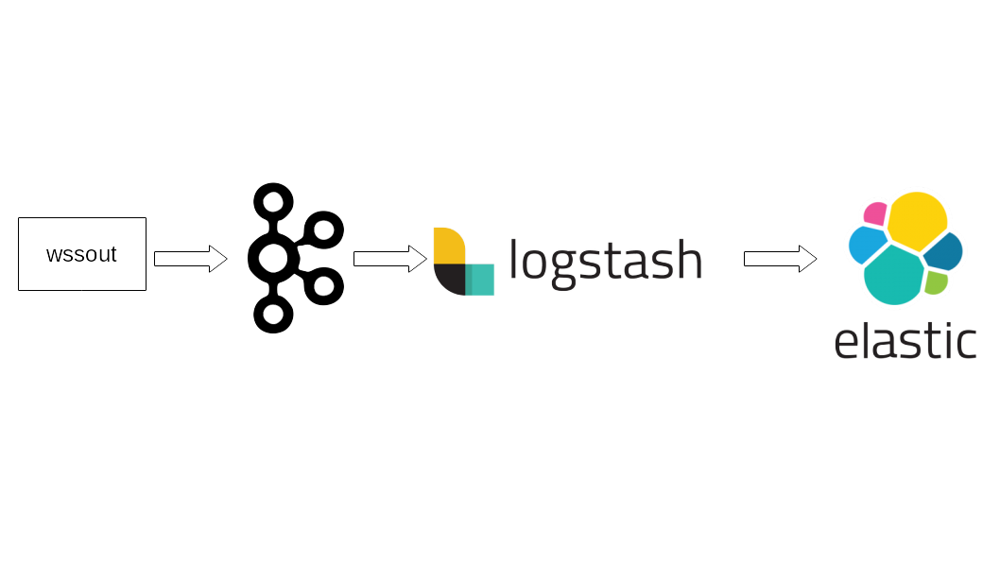

# wssout 
Is a connector script that connects to a websocket stream as a client and writes the receiving data to different sinks. At the moment there are only two sinks, Kafka and standard out.

## Usage

```shell
wssout.py -f <config file>
```
#### Example
```shell
wssout.py -f hoteth.conf
```

#### Config File Parameters:

Parameter|Description
---|---
wslink| websocket URL
wslink_param|connection payload (set to null if none)
out|sink type
topic|name of Kafka topic to sink (kafka only)
kakfa_broker|kafka broker/bootstrap-server url (kafka only)


Standard Out Example
```javascript
{
  "wslink": "wss://ws-feed.gdax.com",
  "wslink_param": {"type": "subscribe", "product_id": "ZRX-USD"},
  "out":"stdout"
}
```

Kafka Example
```javascript
{
  "wslink": "wss://stream.binance.com:9443/ws/hoteth@trade",
  "wslink_param": "None",
  "topic": "hoteth",
  "kafka_broker": "localhost:9092",
  "out":"kafka"
}

```

## Use Cases

### wssout.py to KAFKA to Apache SPARK 


### wssout.py to KAFKA to Elastic using Logstash

